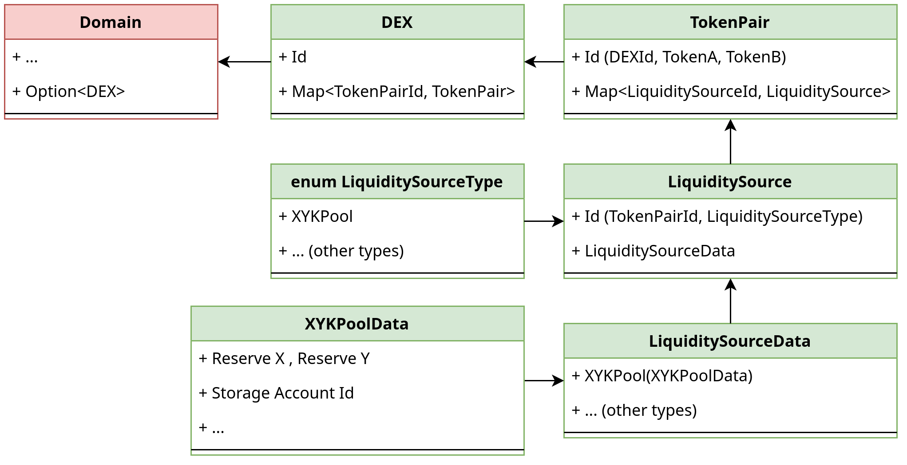
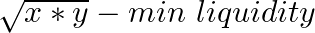
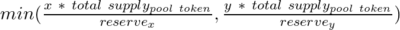
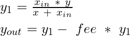
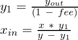

# Iroha 2 DEX Technical Documentation

## Glossary
DEX - Decentralized Exchange\
ISI - Iroha Special Instruction

## Overview

Iroha2 DEX is implemented as an optional module of Iroha2, and can be enabled in compile time. It introduces new core ISIs and Queries in order to support interaction with DEXes and liquidity sources. In accordance with the Iroha2 architecture, there are domains to which set of accounts and assets are linked. Following this approach, multiple DEXes could be registered in the system, but at most one for each domain. This does not limit exchange capabilities, as a DEX in one domain could register token pairs with assets in different domains. The current version of Iroha2 DEX requires all pairs (and therefore associated pool reserves) to contain a base asset - which is XOR - in order to mitigate liquidity provision issues. Users of the exchange do not need to control these details, as APIs both in queries and swaps provide an abstraction, automatically building paths through the base token between arbitrary tokens.

## Permissions

Interactions with Iroha2 DEX can be logically ordered into 3 types: Management ISIs, User ISIs and Queries.
Management ISIs require special permissions to operate, since they act upon the behavior and parameters of a DEX, its underlying token pairs, and its liquidity sources. Those permissions are `CanInitializeDEX` and `CanManageDEX(DEX_ID)`. The former permission belongs to the system owner account, and is used to initialize a new DEX in a domain and specify a particular DEX owner account. The DEX owner account receives the latter permission, which allows it to call Management ISIs.
User ISIs do not require special permissions, but only the general permissions needed to control assets (e.g. transfers).
Queries are not permissioned in the current version, thereby allowing any account to receive information about the DEX.

## Implemented features

*Management ISIs:*
- **InitializeDEX** - create DEX in Domain, set DEX owner account.
- **CreateTokenPair** - create pair A-B.
- **CreateLiquiditySource** - create liquidity source for pair, e.g. XYKPool for pair A-B.
- **SetFeeOnXYKPool** - set fee deducted from XOR pool during swaps; default is 30 basis points.
- **SetProtocolFeePartOnXYKPool** - set protocol fee to be deducted from regular fee and sent to protocol owner account, e.g. DEX owner. Disabled by default.

*User ISIs:*
- **AddLiquidityToXYKPool** - deposit tokens into pool: deposit A, deposit B, receive pool tokens.
- **RemoveLiquidityFromXYKPool** - burn pool tokens, receive A and B.
- **SwapExactTokensForTokensOnXYKPool** - exchange, deposit A and receive B, indicate desired amount for A.
- **SwapTokensForExactTokensOnXYKPool** - exchange, deposit A and receive B, indicate desired amount for B.

NOTE: The behavior for **RemoveTokenPair** and **RemoveLiquiditySource** is currently unspecified. Removal of associated entities should induce return of locked liquidity and removal of pool tokens from liquidity providers to avoid misuse if the pool is re-initialized.

*Queries:*
- **GetDEX**, **GetDEXList** - get info about particular DEX, list initialized DEXes.
- **GetTokenPair**, **GetTokenPairList**, **GetTokenPairCount** - get info about token pairs.
- **GetXYKPoolInfo** - get info about state of particular XYK pool.
- **GetFeeOnXYKPool**, **GetProtocolFeePartOnXYKPool** - get info about current fees.
- **GetPriceForInputTokensOnXYKPool** - get price of output token, if exact input amount is specified.
- **GetPriceForOutputTokensOnXYKPool** - get price of input token,  if exact output amount is specified.
- **GetOwnedLiquidityOnXYKPool** - specify amount of pool tokens, get corresponding amount of pair tokens.

*Debug ISIs*
- **AddTransferPermissionForAccount** - allow user to transfer own tokens.

## Code Structure

The core logic of Iroha2 DEX is contained in a `dex` rust module (`dex.rs`) in the `iroha` crate. This approach was taken in order to keep Iroha Core isolated from DEX and prevent it from becoming monolithic in its features. Although some minor proposals were accepted into Iroha Core because of new functionality requirements, these are of general use.

`iroha/src/dex.rs`:
- (lines 12-267) Entities: DEX, TokenPair, LiquiditySource, XYKPoolData
- (lines 268-3199) `isi` module:
    - (lines 268-427) ISI definition
    - (lines 428-600) DEX management logic
    - (lines 601-1717) `xyk_pool` module with implementation for pools logic
    - (lines 1718-1855) helper functions for transfers/burn/mint
    - (lines 1856-3199) `tests` module with all dex-related tests
- (lines 3200-3860) `query` module
    - (lines 3200-3319) inner helper functions for internal queries
    - (lines 3320-3860) structs representing data passed in queries, used in `query.rs`

`iroha/src/query.rs`
- Iroha query definitions with DEX extensions

`iroha_client_cli/src/main.rs`:
- Iroha core client features
- `dex` module with DEX-specific syntax definition

## Entities

All Entities consist of a data struct and a separate ID struct, as identification is a mostly a composite of other identification structs. There are the following structures in DEX:

- `DEX` struct contains data such as owner account, base token, and registered token pairs. Identification is a domain name.
- `TokenPair` contains registered liquidity sources. Indentification is a containing DEX ID and a pair of assets.
- `LiquiditySource` contains data related to a particular source type. Identification is a containing TokenPair ID and liquidity source type. 
- `LiquiditySourceData` enum, used in LiquiditySource; wraps concrete liquidity source data struct.
- `LiquiditySourceType` enum with all liquidity source types; used in APIs and IDs.
- `XYKPoolData` one of the liquidity source data structs; contains pool info such as fee values, current reserve amounts, pool token definition and reserve storage account ID.

The top-level DEX object is stored in the Domain struct (Iroha Core), which itself is stored in WorldStateView. DEX data is therefore ultimately stored in WorldStateView. This ensures consensus and reduces the need for manual checks, given that data-changing operations are performed via ISI mechanisms and queries via Iroha Queries.

Scheme:

<center></center>

## Control Flow Examples

### Adding Liquidity

First, the `AddLiquidityToXYKPool` ISI is constructed with parameters. When invoked, the associated `execute()` function is run, leading to logic execution: `get_optimal_deposit_amounts()` is called to determine if given amounts are good for existing proportions; if so, tokens are transferred via `transfer_from()` and pool tokens are minted via `mint_pool_token_with_fee`. 

### Swapping Tokens (with desired input)

First, the `SwapExactTokensForTokensOnXYKPool` ISI is constructed with parameters. When invoked, the associated `execute()` function is run, leading to logic execution: `get_amounts_out()` goes through tokens in the provided path, querying individual pools of corresponding pairs, thus resulting in a swap amounts chain containing an input amount, all intermediary pool amounts and fees, and an output amount. This chain is passed to `swap_tokens_execute()`, which transfers caller tokens into the first pool and initiates a chain of swaps via `swap_all()` and underlying `swap()`. The final swap output is redirected to the recepient account, e.g. the original sender.  


## Math (XYK Pool)

The pool math is based on a classic model, with a modification to the fee deduction mechanism - the fee is not deducted in a fixed direction, e.g. always deducted from the input tokens, but rather from a fixed base token, i.e. always from the XOR part of exchange. This is done to provide a basis for further model development, i.e. alternative fee usage scenarios.

### Adding Liquidity for the Initial Provider (when pool is empty)
X and Y are amounts of pair tokens deposited; minimum liquidity is permanently locked (this is needed to reduce pthe ossibility of attack which results in the pool being too expensive for small providers to add liquidity). Here resulting amount of pool tokens is derived via sqrt of reserves product; this is done to mitigate dependency between the pool token quantity and the actual price of either of the pair tokens (the dependency should be on both pair tokens rather than only one because they present different values).

<center></center>

### Adding Liquidity for Further Providers
X and Y are amounts of pair tokens deposited. After initial proportions are set, further deposits need to adhere to them. The amount of pool tokens is also derived from existing proportions:

<center></center>

### Swap Tokens with Desired Input Amount (input is XOR)
If the input (user) token is XOR, the output (target) amount is derived as follows:

<center></center>

>where y_out output tokens go from reserve to user, x_in - fee*x_in input tokens go from user to reserve, and fee*x_in input tokens go from user to fee-storage.


### Swap Tokens with Desired Input Amount (output is XOR)
If the output (target) token is XOR, the output (target) amount is derived as follows:

<center></center>

>where y_out output tokens go from reserve to user, x_in input tokens go from user to reserve, and fee*y1 output tokens go from reserve to fee-storage. 


### Swap Tokens with Desired Output amount (input is XOR)
If the input (user) token is XOR, the input (user) amount is derived as follows:

<center></center>

>where y_out output tokens go from reserve to user, x_in * (1 - fee) input tokens go from user to reserve, and fee*x_in input tokens go from user to fee-storage.


### Swap Tokens with Desired Output amount (output is XOR)
If the output (target) token is XOR, the input (user) amount is derived as follows:

<center></center>

>where y_out output tokens go from of reserve to user, x_in input tokens go from user to reserve, and y1-y_out output tokens go from reserve to fee-storage. 

## Build and Run

### Requirements:
- linux / unix-based OS
- docker, docker-compose
- rust environment, e.g. latest stable toolchain via [rustup](https://rustup.rs)
- CWD is iroha project root, e.g. `./projects/iroha/`

### Run tests with detailed logs of operations
```shell
cd ./iroha
cargo test --features "dex" -- --nocapture --test-threads=1
# or single exact test
cargo test test_xyk_pool_add_liquidity_should_pass --features "dex" -- --nocapture --test-threads=1
```
Tests output with detailed logs are provided as [tests.log](tests.log) file for convenience.

### Run tests without logs
```shell
cd ./iroha
cargo test --features "dex"
```

Local testnet could be run with docker.

1. Build Iroha with DEX
```shell
cd ./iroha
cargo build --features "dex"
cd ..
docker-compose build
docker-compose up
# after use
docker-compose down
```
2. Build client

```shell
cd ./iroha_client_cli
cargo build
cd ..
mkdir client_test
cp ./target/debug/iroha_client_cli ./client_test/iroha_client_cli
cp ./iroha_client_cli/config.json ./client_test/config.json
```

## Tests

Tests are also contained in the DEX module, comprised of unit tests for critical components and integration tests to represent feature use cases. In order to make test cases compact and readable, an incrementally modular test approach was used. This means that there are full unit tests, starting with basic features such as DEX init, creating token pairs, creating accounts, creating liquidity sources, and TestKit modules with compact alternatives that are reused in further tests which depend more on existing state.

The following tests exist currently:

1. `test_initialize_dex_should_pass`
    - tries to initialize a DEX with an appropriate account, then performs and validates a query to retrieve the new DEX by ID and a query listing all DEXes. 
2. `test_initialize_dex_should_fail_with_permission_not_found`
    - tries to initialize a DEX with a newly-created account without any permissions, checks that the correct error is returned, and performs a query listing all DEXes, which should return empty.
3. `test_create_and_delete_token_pair_should_pass`
    - tries to register a token pair with correct assets (XOR for base, other for target) for an initialized DEX (with XOR as base), checks that query-by-ID returns the correct newly registered pair; listing returns the newly registered pair; after removal, listing returns empty.
4. `test_xyk_pool_create_should_pass`
    - for an initialized DEX and registered token pair, tries to create a liquidity source with the type of XYK pool, then queries the pool and checks that it contains default values for its data store.
5. `test_xyk_pool_add_liquidity_should_pass`
    - for an initialized DEX, registered token pair, and registered liquidity source, creates a new account with minted tokens and tries to invoke AddLiquidity ISI via its identity, then queries and checks the pool state and the state of the created account.
6. `test_xyk_pool_remove_liquidity_should_pass`
    - for an initialized DEX, registered token pair, and registered liquidity source, creates a new account with minted tokens, invokes AddLiquidity and RemoveLiquidity ISIs via their identities, then queries and checks the pool state and the state of the created account.
7. `test_xyk_pool_optimal_liquidity_should_pass`
    - tests edge cases for the low level function, which calculates, using existing pool propotions, whether it is possible to add liquidity with given amounts of pair tokens, limits, and pool reserves, either meeting limits or otherwise returning an error.
8. `test_xyk_pool_quote_should_pass`
    - tests edge cases for the low level function, which calculates, given amounts of tokens and pair reserves, the equivalent amount of another token.
9. `test_xyk_pool_swap_assets_in_should_pass`
    - for an initialized DEX, registered token pair, registered liquidity source and pool with added liquidity, tries to exchange tokens with a desired input amount, then queries and checks the pool state, pool reserves account, and trader account.
10. `test_xyk_pool_get_target_amount_out_should_pass`
    - tests edge cases for the function calculating the price for tokens given pool reserves (variant with desired input amount, when the input token is XOR)
11. `test_xyk_pool_get_base_amount_out_should_pass`
    - tests edge cases for the function calculating the price for tokens given pool reserves (variant with desired input amount, when the output token is XOR)
12. `test_xyk_pool_swap_assets_out_should_pass`
    - for an initialized DEX, registered token pair, registered liquidity source and pool with added liquidity, tries to exchange tokens with a desired output amount, then queries and checks the pool state, pool reserves account, and trader account.
13. `test_xyk_pool_get_base_amount_in_should_pass`
    - tests edge cases for the function calculating the price for tokens given pool reserves (variant with desired output amount, when the input token is XOR)
14. `test_xyk_pool_get_target_amount_in_should_pass`
    - tests edge cases for function calculating price for tokens given pool reserves (variant with desired output amount, when the output token is XOR)
15. `test_xyk_pool_two_liquidity_providers_one_trader_should_pass`
    - uses all components of TestKit providing a complete use case in which DEX is initialized and two token pairs are registered
16. `test_xyk_pool_get_price_should_pass`
    - for initialized entities, adds liquidity to a pool and then queries the price in 4 variants: XOR->DOT with desired input and output, DOT->XOR with desired input and output. 
17. `test_xyk_pool_get_owned_liquidity_should_pass`
    - for initialized entities, add liquidity to a pool via 2 new accounts and then queries and checks the amount of tokens they can claim by burning received pool tokens.


## CLI client

As an interaction example, the Iroha2 CLI client was extended to support new DEX-specific syntax and logic, and helpers required to access needed core features were completed. The new syntax is shown via a demo usecase:

### Prepare

In order to run demo, a specific setup is needed. First, Iroha2 (with DEX enabled) needs to be running in docker. This is discussed in the `Build and Run` section.

Second, an executable of `iroha_client_cli` needs to be used; please refer to `Build and Run` in order retrieve it.
Demo configs can be found in the `demo` directory shipped with this documentation; for simplicity, the built `iroha_client_cli` should be copied multiple times according to the following scheme:

```
/demo
    /root
        iroha_client_cli
        swap_setup_env_v2.sh
        config.json
    /user_a
        iroha_client_cli
        config.json
    /user_b
        iroha_client_cli
        config.json
    /user_c
        iroha_client_cli
        config.json
```
### Cli demo

### Step 1 - Initialize Environment
With a root identity initialize DEX, create token pairs and liquidity sources. Also create accounts and mint initial tokens for them. This can be done manually (as shown below).
**Alternately the `swap_setup_env_v2.sh` script can be used (cwd should be in /demo/root directory)**
```shell
cd /demo/root
# via root identity
./iroha_client_cli domain add --name="Soramitsu"
./iroha_client_cli domain add --name="Polkadot"
./iroha_client_cli domain add --name="Kusama"
./iroha_client_cli asset register --domain="Soramitsu" --name="XOR"
./iroha_client_cli asset register --domain="Polkadot" --name="DOT"
./iroha_client_cli asset register --domain="Kusama" --name="KSM"
./iroha_client_cli account register --domain="Soramitsu" --name="DEX Owner" --key="[120, 221, 193, 217, 83, 191, 157, 223, 1, 2, 205, 104, 209, 1, 180, 200, 29, 70, 220, 189, 221, 136, 221, 64, 31, 12, 44, 39, 179, 57, 141, 181]" 
./iroha_client_cli dex initialize --domain="Soramitsu" --owner_account_id="DEX Owner@Soramitsu" --base_asset_id="XOR#Soramitsu"
./iroha_client_cli dex token_pair --domain="Soramitsu" create --base_asset_id="XOR#Soramitsu" --target_asset_id="DOT#Polkadot"
./iroha_client_cli dex token_pair --domain="Soramitsu" create --base_asset_id="XOR#Soramitsu" --target_asset_id="KSM#Kusama"
./iroha_client_cli dex xyk_pool --domain="Soramitsu" --base_asset_id="XOR#Soramitsu" --target_asset_id="DOT#Polkadot" create
./iroha_client_cli dex xyk_pool --domain="Soramitsu" --base_asset_id="XOR#Soramitsu" --target_asset_id="KSM#Kusama" create
## setup User A Account
./iroha_client_cli account register --domain="Soramitsu" --name="User A" --key="[162, 172, 183, 13, 229, 237, 8, 113, 177, 22, 100, 41, 174, 202, 106, 25, 216, 241, 18, 226, 77, 138, 250, 103, 10, 16, 194, 56, 21, 198, 90, 148]"
./iroha_client_cli asset mint --account_id="User A@Soramitsu" --id="XOR#Soramitsu" --quantity="12000"
./iroha_client_cli asset mint --account_id="User A@Soramitsu" --id="DOT#Polkadot" --quantity="4000"
./iroha_client_cli asset mint --account_id="User A@Soramitsu" --id="KSM#Kusama" --quantity="3000"
./iroha_client_cli account add_transfer_permission --id="User A@Soramitsu" --asset_id="XOR#Soramitsu"
./iroha_client_cli account add_transfer_permission --id="User A@Soramitsu" --asset_id="DOT#Polkadot"
./iroha_client_cli account add_transfer_permission --id="User A@Soramitsu" --asset_id="KSM#Kusama"
./iroha_client_cli account add_transfer_permission --id="User A@Soramitsu" --asset_id="XYKPOOL XOR-Soramitsu/DOT-Polkadot#Soramitsu"
./iroha_client_cli account add_transfer_permission --id="User A@Soramitsu" --asset_id="XYKPOOL XOR-Soramitsu/KSM-Kusama#Soramitsu"
## setup User B Account
./iroha_client_cli account register --domain="Soramitsu" --name="User B" --key="[171, 23, 228, 169, 169, 132, 244, 86, 72, 152, 12, 41, 160, 86, 186, 81, 54, 241, 116, 40, 246, 106, 252, 36, 114, 156, 121, 228, 213, 136, 109, 153]"
./iroha_client_cli asset mint --account_id="User B@Soramitsu" --id="XOR#Soramitsu" --quantity="500"
./iroha_client_cli asset mint --account_id="User B@Soramitsu" --id="DOT#Polkadot" --quantity="500"
./iroha_client_cli account add_transfer_permission --id="User B@Soramitsu" --asset_id="XOR#Soramitsu"
./iroha_client_cli account add_transfer_permission --id="User B@Soramitsu" --asset_id="DOT#Polkadot"
./iroha_client_cli account add_transfer_permission --id="User B@Soramitsu" --asset_id="XYKPOOL XOR-Soramitsu/DOT-Polkadot#Soramitsu"
## setup User C Account
./iroha_client_cli account register --domain="Soramitsu" --name="User C" --key="[196, 239, 3, 91, 95, 202, 55, 187, 149, 152, 2, 30, 178, 165, 167, 193, 45, 239, 205, 216, 185, 213, 155, 161, 92, 147, 242, 254, 27, 112, 199, 189]"
./iroha_client_cli asset mint --account_id="User C@Soramitsu" --id="KSM#Kusama" --quantity="2000"
./iroha_client_cli account add_transfer_permission --id="User C@Soramitsu" --asset_id="KSM#Kusama"
```


### Step 2 - User A adds liquidity to pools XOR-DOT and XOR-KSM
The state of the User Account and Pool Reserve Accounts can be checked (e.g. before and after the operation) via:
```shell
# CWD must be /demo/user_a
./iroha_client_cli account get --domain="Soramitsu" --name="User A"
./iroha_client_cli account get --domain="Soramitsu" --name="STORE XYKPOOL XOR-Soramitsu/DOT-Polkadot"
./iroha_client_cli account get --domain="Soramitsu" --name="STORE XYKPOOL XOR-Soramitsu/KSM-Kusama"
```

To perform a liqudity operation, use:
```shell
# CWD must be /demo/user_a
./iroha_client_cli dex xyk_pool --domain="Soramitsu" --base_asset_id="XOR#Soramitsu" --target_asset_id="DOT#Polkadot" add_liquidity --base_amount="6000" --target_amount="4000"

./iroha_client_cli dex xyk_pool --domain="Soramitsu" --base_asset_id="XOR#Soramitsu" --target_asset_id="KSM#Kusama" add_liquidity --base_amount="6000" --target_amount="3000"
```

### Step 3 - User B adds liqudity to pool XOR-DOT
The state of the User Account and Pool Reserve Account can be checked (e.g. before and after theoperation) via:
```shell
# CWD must be /demo/user_b
./iroha_client_cli account get --domain="Soramitsu" --name="User B"
./iroha_client_cli account get --domain="Soramitsu" --name="STORE XYKPOOL XOR-Soramitsu/DOT-Polkadot"
```

To perform a liqudity operation, use:
```shell
# CWD must be /demo/user_b
./iroha_client_cli dex xyk_pool --domain="Soramitsu" --base_asset_id="XOR#Soramitsu" --target_asset_id="DOT#Polkadot" add_liquidity --base_amount="500" --target_amount="500"
```

### Step 4 - User C swaps KSM for DOT
The state of the User Account and Pool Reserve Accounts can be checked (e.g. before and after the operation) via:
```shell
# CWD must be /demo/user_c
./iroha_client_cli account get --domain="Soramitsu" --name="User C"
./iroha_client_cli account get --domain="Soramitsu" --name="STORE XYKPOOL XOR-Soramitsu/DOT-Polkadot"
./iroha_client_cli account get --domain="Soramitsu" --name="STORE XYKPOOL XOR-Soramitsu/KSM-Kusama"
```

Perform a swap with a given input token quantity:
```shell
# CWD must be /demo/user_c
./iroha_client_cli dex xyk_pool_swap --domain="Soramitsu" --path="[\"KSM#Kusama\", \"XOR#Soramitsu\", \"DOT#Polkadot\"]" --input_amount="2000"
```

### Step 5 - User B removes liquidity from pool XOR-DOT
The state of the User Account and Pool Reserve Accounts can be checked via:
```shell
# CMD must be /demo/user_b
./iroha_client_cli account get --domain="Soramitsu" --name="User B"
./iroha_client_cli account get --domain="Soramitsu" --name="STORE XYKPOOL XOR-Soramitsu/DOT-Polkadot"
```

Perform a liquidity operation with:
```shell
# CMD must be /demo/user_b
./iroha_client_cli dex xyk_pool --domain="Soramitsu" --base_asset_id="XOR#Soramitsu" --target_asset_id="DOT#Polkadot" remove_liquidity --liquidity="407"
```

All commands for this CLI use case can be also found [here](demo/swap_tokens_xyk_pool_v2.txt).
